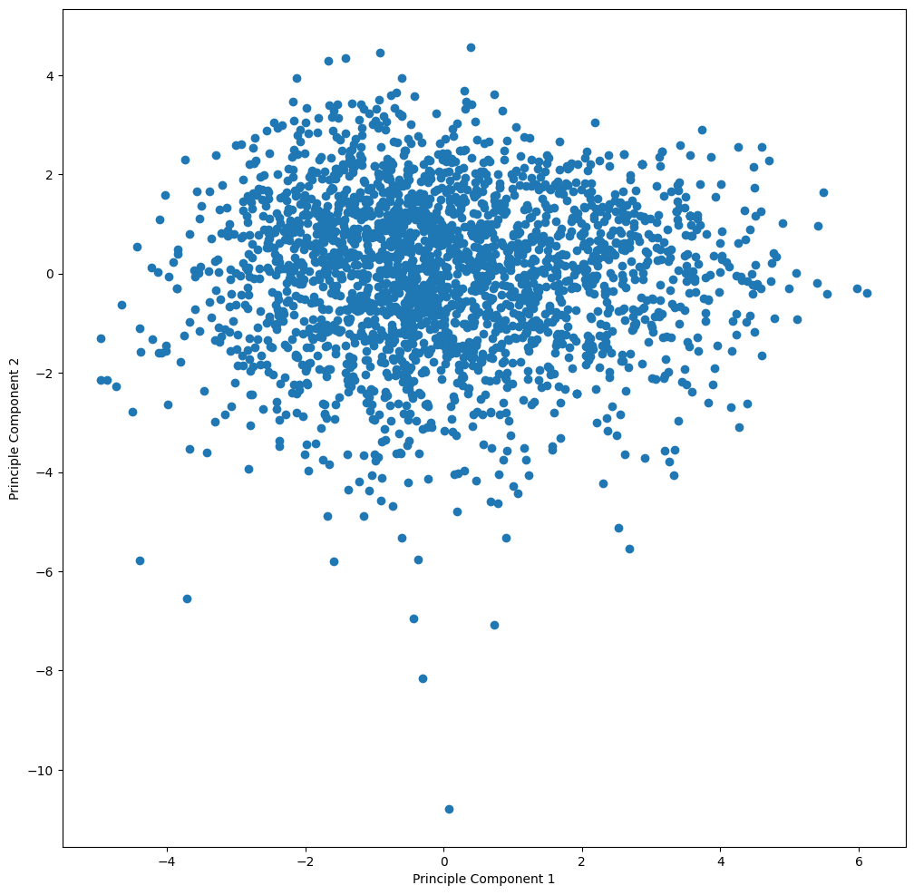

# Financial Company Customer Survey Principle Component Analysis

A financial institution in Washington 💰 has expressed concerns that its existing membership may not align with its corporate values. This realization led them to acknowledge a need for more understanding regarding the values of their members. To address this, they surveyed 2,421 members. Utilizing dimensionality reduction on continuous datatypes with Principal Component Analysis (PCA), we're able to gain insights into different perspectives to analyze the data.

Component 1 explains 21% of variance, and the first three PCs explain over 50% of the variance.

The three variables with the highest loadings for Principal Component 1 (PC1) were Progressivism (0.5), Sustainability (0.3), and Education Level (0.2), all of which exhibited a positive correlation. In contrast, Authority showed minimal correlation with PC1.

To further investigate, I created a scatter plot with PC1 on the x-axis and PC2 on the y-axis. I then applied k-means clustering to identify 6 groups, focusing on target customers where both PC1 and PC2 are greater than 1.

 

In conclusion, by applying the PCA dimensionality reduction technique, I clustered the two PC that explain the most variance in the data. However, due to the limited value of insights gained from the clustering, I do not recommend proceeding with further analysis; the k-mean clusters do not appear to have any importance. If further investigation were to be conducted, I would consider analyzing each cluster using linear regression while experimenting with an decreased number of clusters.

The heart of the survey was the Moral Foundations Theory of Jonathan Haidt. Members were surveyed on the Moral Foundations Questionnaire, which you should take so you understand the test. Survey respondents were scored on the five foundations as well as a single-number summary, Progressivism.

The financial institution values Localism, Sustainability, and Education. These aspects of member's values were assessed in the survey as well. Localism and Sustainability used validated scales and thus can be summarized via a single score, where higher values indicate greater support for the values. Education is summarized by the following three questions, which we do not have evidence can be combined into a single score:

In general, public schools provide a better education than private schools.
Public school teachers are underpaid.
Experience is more important than education in determining success in life. These questions were evaluated on a 1 to 6 scale where 1 indicated "Strongly Disagree" and 6 indicated "Strongly Agree".

Finally, we have information on the member that can be used to understand variation in their values.
<<<<<<< HEAD

# Data Dictionary

The data consists of the following columns:

* ID: a unique identifier for the survey respondent.
* age: the age of the respondent.
* gender: gender was evaluated with robust scale and collapsed into male/female/other for 
  those whose gender identity was not male or female.
* engagement: three categories of engagement with the financial institution.
* mem.edu: the self-reported education level of the member with the following scale:
* zip: the member zip code. 
* channel: how the member joined the financial institution. Options are "Loan" if they joined 
  via an auto loan, "Branch" if they joined at a branch and other for online or unknown. 
* progressivism/harm/fair/in.group/authority/purity: The MFQ results.
* account.age: the age of the member's account, in years. 
* region: The region of Washington the member lives in. May be easier to work with than zip.
* public.sector: has the person ever been a public employee?
* sustainability/localism: Scores on the validated scales. Higher values indicate greater
  support for the value.
* pub.greater.priv/experience.more.important/teachers.underpaid: The responses to the 
  education questions above. 
* main.focal.value: Respondents were asked, "Below is a list of broad areas to which people 
  often dedicate their volunteer or philanthropic efforts. From this list, please select the 
  most important to you. If an area of particular importance is missing, please let us know 
  about it in the space for 'other.'" This column holds the respondents' answer to that question.
* support.of.focal.value: Respondents were given an opportunity to indicate how they 
  supported their focal value. Those responses were collapsed into a single score, where 
  a higher value indicates more support.
=======
>>>>>>> d4fb24dc2b5d1755af5f429d6840e38423c071a6
